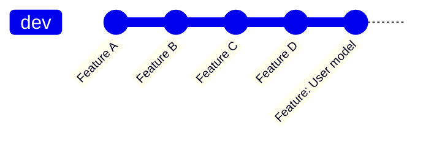
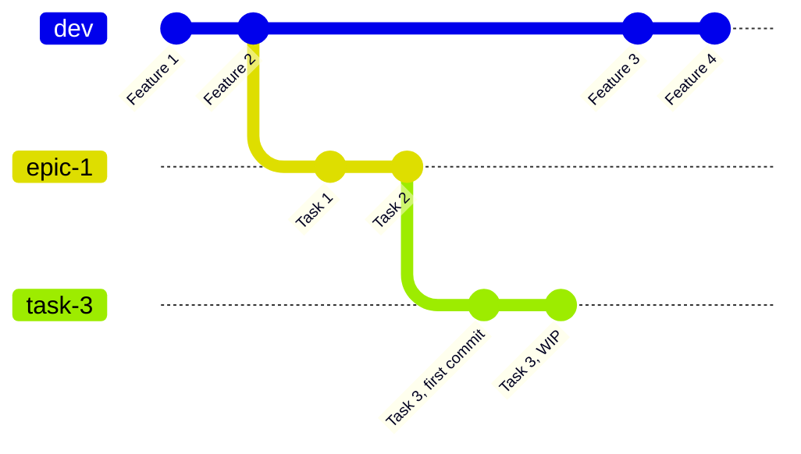
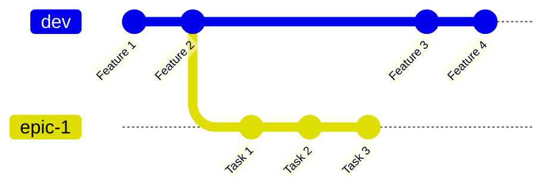
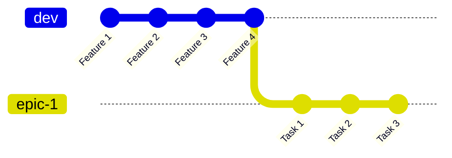
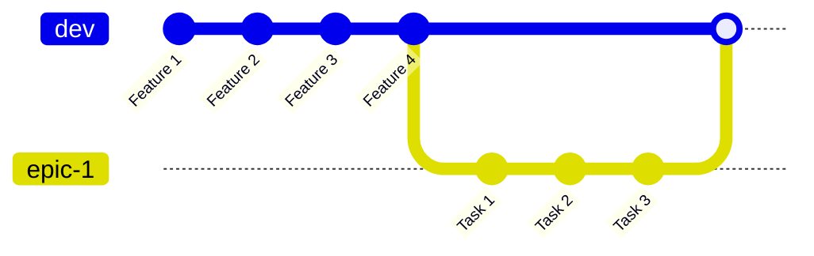

# A git flow that actually works

## Branches

There are 3 kind of banches:

* **👑 Stable**
  * There are always only 2: `main` and `staging`.
  * No forced pushes allowed.
  * `staging` is developer's main branch. It must no contain bugs, it can be pushed to production anytime.
  * `main` acts as a pointer to deploy code to production.
* **🚧 Epic**
  * There are as many as concurrent epic the team is working on.
  * They have a short and easy to remember name. Eg `signup`, `feature-x`, `add-cache`.
  * Forced pushes are allowed.
  * Squash is forbidden.
  * Deleted after the epic is integrated to `staging`.
* **🛠 Task**
  * There are as many as needed.
  * Name is composed by its _ticket ID_, plus optionally the _task name_. Eg. `JIRA-1234`, `asana-5678-endpoint`.
  * Forced pushes are allowed.
  * Deleted after the task is integrated to `staging` or an `epic` branch.
  * Squash is required before merging.
  * These are **the only branches that require a peer review** 🔍.

| Branch kind | Naming | Forced pushes? | Squasing? | Peer review? |
|-------------|--------|----------------|-----------|--------------|
| Stable | `main` and `staging` | ❌ | ❌ | ❌ |
| Epic | `[short-and-rememberable]` | ✅ | ❌ | ❌ |
| Task | `[ticket id] + [task name]` | ✅ | ✅ | ✅ |

## Coding a task

### 1. Checkout the branch

* **Is this a hotfix?** Checkout from `main`.
* **The task belongs to an epic?** Checkout from its `epic` branch.
* **Is this a standalone task?** Checkout from `staging`.

```sh
# Make sure you have the latest changes
git pull <branch_you_are_checking_out_from>

# Create the branch
git checkout <new_branch_name>
```

Example:

```sh
git pull dev
git checkout JIRA-1234-my-task
```

[More info about checking out a branch here](https://support.atlassian.com/bitbucket-cloud/docs/check-out-a-branch/)

### 2. Code and commit whatever you want

* 💡 **Pro tip:** When squahing, the first commit description will be the only that will remain. So, **make a good first commit description** from the begining.
* A good convention for commit description is: `[Feature | Improvement | Bugfix]: [Short description about the changes]`.
* You may want to split your code in several commits to facilitate peer review. For exmaple:
  * 1st commit: Create database migrations.
  * 2nd commit: Add model logic.
  * 3rd commit: Add tests. 

```sh
# Stage your changes
git add .

# Commit them
git commit -m "<commit_description>"

# Push the changes
git push <task_branch>
```

Example:

```sh
git add .
git commit -m "Feature: Creates User model"
git push origin JIRA-1234-user-model
```

Code and commit the times you need.

### 3. Send to peer review

First, make sure your branch is updated with the branch you checked out from (`staging`, `main` or an epic branch).

If it's updated, then continue. If there are new changes on the base branch, [rebase your branch](#rebasing) to include them.

Finally, create a Pull request on Github / Gitlab or any repositories manager you use.

### 4. Squash and merge

Once the peer request is done and fixed any issues, [rebase and squash](#squashing) all of your commits into one:


Finally merge the `task-1` branch into the branch you first checked out from.

```sh
# Checkout base branch
git checkout <base_branch>

# Merge changes
git merge <task_branch>
```

Example:

```sh
git checkout dev
git merge task-1
```

If you followed the process correctly the git history will look linear, with you task contained in a single commit:



## Building an epic

### 1. Checkout the branch

Checkout a new branch from `staging` with a short and rememberable name. Eg. `sign-in`.

### 2. Code all tasks

Each new task, will follow its own individual ["Coding a task"](#coding-a-task) process. Each task may be composed of multiple commits, but before merging to the epic branch they must pass a peer review and be [squashed](#squashing).

Working on a new task (`task-3`):



And then merging it as a squashed commit:



### 3. Update and test it

After all the tasks of the epic are finished, its time to include all the new changes available in the base branch (`staging`). To do that, it's necessary to [rebase](#rebasing) `staging`:



The most important rule of `staging` is, it can not containg bugs. Therefore, this branch must pass QA validations before mergining it.

### 4. Merge it

Since the epic branch rebased `staging` already and squashes are forbidden on epic branches to keep track of all the tasks that composed the epic, then we'll use `merge`, however it's better to use the "No fast forward" option (`--no-ff`) to create a new empty commit and be able to know when the epic started and when it finished in the git history.

```sh
# Checkout base branch
git checkout <base_branch>

# Merge changes
git merge --no-ff <epic_branch>
```

Example:

```sh
git checkout dev
git merge --no-ff epic-1
```

A good description for the empty commit is: `Epic: [Short description of the epic]`.

If you followed the process correctly, a merged epic would look like:



## Deploying to production

We know `staging` contains no bugs and it's ready to be deployed to production.

Then, we only need to checkout `main` and make a simple `merge` to `staging`:

```sh
# Checkout main
git checkout main

# Merge changes to dev
git merge dev
```

This, will join `main` and `staging` in the same commit. No need to use `--no-ff` option.

## Rebasing

Let's say you need to update the branch `task-1` with the latest changes from `staging`. It looks like:


Then run the following command:

```sh
git rebase <branch_you_want_to_rebase>
```

Example

```sh
git rebase dev
```

This will move the `task-1` branch to the end of `staging`, including all of its changes:


If there were conflicts while `task-1` rebases `staging` an error message will appear and the rebase will be paused. It's normal, just fix the conflicts, stage the changes and run `git rebase --continue`. Each commit is rebased individually, you might have to repeat this process (up to once per commit).

If you think you f\*cked up while solving conflicts, run `git rebase --abort` to stop the rebase.

[More info about rebasing here](https://www.atlassian.com/git/tutorials/rewriting-history/git-rebase)

## Squashing

Squasing is very similar to [rebasing](#rebasing) except it adds one more step.

Let's say you need to update the branch `task-1` with the latest changes from `staging` and squash all of the commits into one. It looks like:


Then run the following command (it adds the option `-i` for "interactive"):

```sh
git rebase -i <branch_you_want_to_rebase>
```

Example

```sh
git rebase -i dev
```

This command will open a [vim](https://www.freecodecamp.org/news/how-to-exit-vim/) editor listing the commits on `task-1`:

```
pick 911fe5c0b Feature: User model
pick addde08a4 Migrations
pick 9f8fe391b Tests

# Rebase 00cfe7a44..a9b867653 onto 00cfe7a44 (3 commands)
#
# Commands:
# p, pick <commit> = use commit
# r, reword <commit> = use commit, but edit the commit message
# e, edit <commit> = use commit, but stop for amending
# s, squash <commit> = use commit, but meld into previous commit
# f, fixup [-C | -c] <commit> = like "squash" but keep only the previous
# etc....
```

Then:
1. Press `i` to edit the content of the file.
2. Leave the first commit as it is, move to the second.
3. Replace the word `pick` for an `f` on commits 2 to n. This means those commits will be squashed to commit 1.
4. Press `Esc` key, to exit from editing mode.
5. Write `:wq` to write and quit the file.
6. Press `Enter` key.

The file after step 3 should look like:
```
pick 911fe5c0b Feature: User model
f addde08a4 Migrations
f 9f8fe391b Tests

# Rebase 00cfe7a44..a9b867653 onto 00cfe7a44 (3 commands)
#
# Commands:
# p, pick <commit> = use commit
# etc....
```

Once the rebase and squash is finished, the branch should look like:


Similar to rebasing, you'll need to fix conflicts when they exist and use `git rebase --continue` or `git rebase --abort` as needed.
